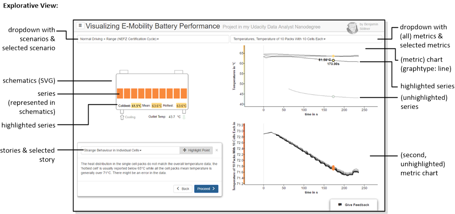

In order to understand the application architecture which is described further below (and also the sourcecode comments) it is useful to know how I formally call / define a few things you see on the screen when using the visualization:

### Explanatory View

* **Hamburger menu**: The main navigation menu; usually the different navigation items in the hamburger menu are reffered to as **routes**.
* **View**: one single page from the Hamburger Menu giving one consistent interactive experience to the user
* **Column**: a vertical slice of the grid inside a view
* **Chart**: the complete two-dimensional visualization including data points, labels, axis etc. etc. - all managed in D3.js but _not_ including the "Storybox" or "Schematics".
* **Summary chart**: the chart shown on the Explanatory View which, in our application shows different battery scenarios in an aggregated way.
* **Graph**: the area of the chart between the two main axes.
* **Graphtype**: Which kind of chart to draw (**scatter**/**line**).
* **Series**: A set of data values that belongs together, is captured together during an experiment with one metric at one location and can be displayed by one graphical series on the chart. I often use the slightly awkward pig-plural **serieses** for its plural to make it clear when I am talking about one series or a collection of them.
* **Marker**: A specially highlighted and labelled data point; a special kind of marker is shown for the data point which you highlight with your mouse.
* **t-value**: A third dimension besides x and y for scatter plots, usually "time" if time is not used for x and y. In this case, the t-value can be only perceived by appearant "flow" of a line scatter points and examined by hovering over single data points.
* **x-/y-axis**: Both axes have **labels** and **ticks**, whereas I use the term **short tick** for the part of the tick visible outside of the graph area and **long tick** for the grid visible on the graph itself. Currently the graph is styled such that only for the origin those grids are shown.
* **Sticker**: A decorative image or symbol that is mapped into the graph area.
* **Annotation**: Free-form text floating over the graph area.
* **Hotspot**: A box highlighting a certain area of the graph for the sake of story telling.
* **Storybox**: A prominent text box alongside with the chart which supplies the user with a narrative.

### Exploratory View

In addition to some terminology from the  explanatory scenario, the following terms need to be understood:

* **Scenarios** & **selected scenario**: A battery type and battery use case for which data of different metrics was collected during an experiment or simulation. The exploratory view lets you select one from a set of different scenarios.
* **Metrics** & **selected metric**: A metric that is collected during a scenario can be, e.g., Voltage, State-of-Charge, Temperature etc. The "metric" in our definition contains all measurements of this metric, potentially at different locations. Metrics can further be subdivided by series(es). A metric can be **highlighted** if the mouse is moved into the chart of this metric.
* **Metric chart**: A chart displaying all the series(es) of one metric. The metric chart has the **graphtype: line** (time-series).
* **Series**: A single set of data collected for one metric at one location (like the Temperature of a single cell).
  * Multiple series(es) of one metric are displayed together in one metric chart using different, overlapping time series lines. A series can be **highlighted** if the mouse is moved directly on top of its time series line.
  * A series is also represented as a shape or primitive in the battery schematics. The associated shape can take the text or color associated with a series's value as the user moves the mouse over the chart.
  * **Schematics**: The facsimile battery representation representing the battery type and scenario. This is a SVG graph with many custom elements that are filled / styled / captioned based on the data series's value.
