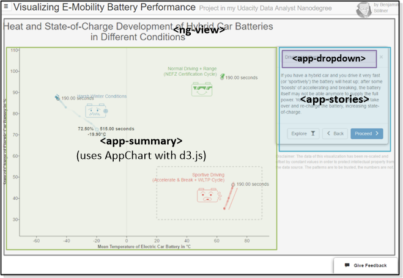
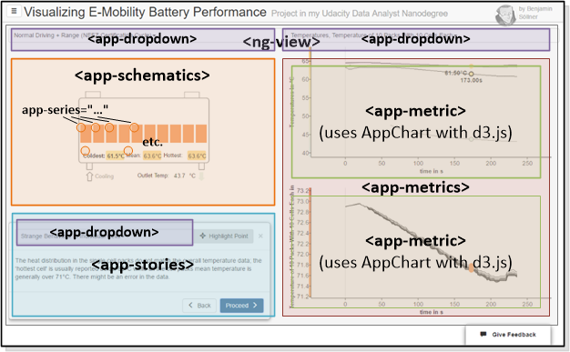

This application makes use of the [AngularJS][angularjs] framework. Simply said, AngularJS allows for the specification of "custom HTML elements" which can behave like independent, re-usable components that we can instantiate with varying properties across the site. This was especially useful for this project given that we had to re-use a dynamic number of charts, schematics, dropdowns etc. across this application - all being components that Standard-HTML did not support but that would be difficult to re-use if we relied solely on the "DOM manipulating" nature that libraries like d3.js and jQuery support.

In our application, those Angular components are prefixed with ``App...`` (in file, class or Requirejs module names) or ``app-`` (in tag or attribute names). Usually, every component comes with the following artifacts:

* Javascript code for the component in ``/js/<Component>.js`` - contains code for so-called "controllers" (classes named ``<Component>Controller`` by convention) and "directives" (classes named ``<Component>Directive`` by convention). Those components are registered compoundly in the ``/js/main.js`` file.
* Parametrized HTML templates stored in ``/templates/<Component>.html`` (or ``.jade``) which are loaded on-demand by AngularJS.
* Associated CSS rules stored in ``/css/_<Component>.css``. Those CSS rules are included compoundly in the ``/css/main.min.css`` file.

The following sections describe the so-called "directives" used in the two main views of the application.

### Explanatory View

* ``<ng-view>`` is a standard AngularJS directive that allows including sub-pages based on the current navigation state. The sub-pages for explorative, explanatory and documentation view are stored in the repositories ``/views`` section.
* ``<app-summary>`` receives the summary data to plot alongside with a context object to store the current interactive state of the visualization. It then draws the explanatory chart using the internal generic ``AppChart`` class (code in ``/js/AppChart.js``) which in turn uses the [d3.js][d3js] framework.
* ``<app-stories>`` receives the stories data and shows a story box with selectable stories. It also shares a context object together with the chart component to be able to update the interactive state of the chart in case the user selects a certain story that requires a certain area of the visualization to be highlighted.
* ``<app-dropdown>`` is a generic component that displays a dropdown menu and lets a user select one or more values (configurable) from a list; it can synchronize the chosen value with a customizable target location.

### Exploratory View

* For ``<ng-view>``, ``<app-dropdown>`` and ``<app-stories>`` see above.
* ``<app-schematics>`` displays the battery schematic SVG file and takes care that any dynamic regions in that SVG element are updated as other values of the metric graphs are selected. This is achieved using the ``app-series`` directive.
* ``app-series`` is a directive that can be annotated to any SVG element inside of the schematic SVG. These annotations make fill color, text or display status of the SVG elements dynamic.
* ``<app-metrics>`` acts as a container for multiple linked metric-graphs and takes care that certain values, like x-axis range are changed compoundly.
* ``<app-metric>``, similar to ``<app-summary>`` above, this component uses the ``AppChart`` class and [d3.js][d3js] to draw the data values it is supplied with. The main difference is the graph type (line instead of scatter) and some additional interactivity in order to link together interactively the metric graph and the battery schematic.

[d3js]: https://d3js.org/
[d3js-license]: https://opensource.org/licenses/BSD-3-Clause
[angularjs]: https://angularjs.org/
