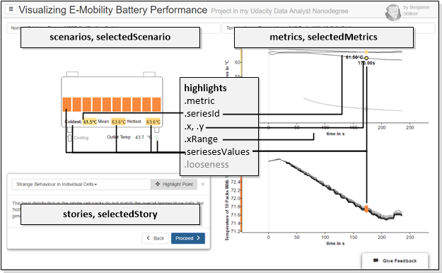
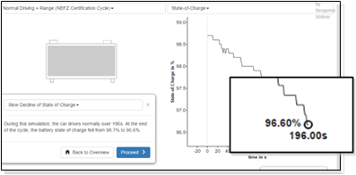
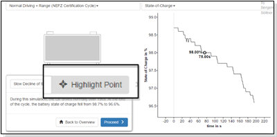
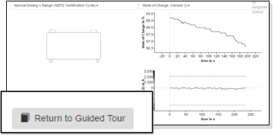
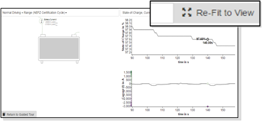
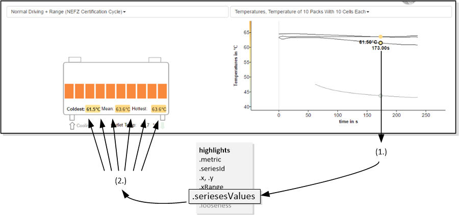

In order to make different [AngularJS][angularjs] components interact (see Page about [Components](tutorial-4Components.html)) AngularJS supports the concept of centralized "scopes", essentially shared variables that hold the applications state. Those scopes may be nested with directives/components having "isolated" scopes, but to understand the component interaction in our application, we have to look into the "top" scope of our application.

### Objects in Top Scope

In the top scope, the following variables are used to govern the applications state. Those variables are handed over as references to the various components. The components then either update the variables on user input or listen to changes of the variables and update their presentation layer accordingly.

* ``scenarios`` - an array of Scenario objects taken directly from the ``/data/scenarios.json`` file (see [JSON Class Structure of Data Files](tutorial-3JSONDataStructure.html)).
* ``selectedScenario`` - the scenario that has been selected from the dropdown menu, an element of the ``scenarios`` array - ``undefined`` if no scenario is selected.

The following metrics are all set to ``undefined`` if no scenario is selected at this moment:

* ``metrics`` - an array of Metric objects taken directly from the ``/data/scenario-<scenarioId>.json`` file (see [JSON Class Structure of Data Files](tutorial-3JSONDataStructure.html)).
* ``selectedMetrics`` - an array of metrics that has been selected from the dropdown menu, a subset of the elements of the ``metrics`` array
* ``stories`` - an array of Story objects taken directly from the ``/data/scenario-<scenarioId>-stories.json`` file (see [JSON Class Structure of Data Files](tutorial-3JSONDataStructure.html)) or ``undefined`` if no stories-file is available.
* ``selectedStory`` - the currently selected story, an element of the ``stories`` object, ``undefined`` if no story is selected.

The main "magic" however lies in the ``highlights`` object which governs the current highlighting & interaction state of the visualization. This object is tied almost to all components on the page and serves as a central model about how the user currently interacts with the data:

* ``metric`` (string) references the metric-ID of the metric chart the user currently hovers over
* ``seriesId`` (string) references the series-ID of the data series the user currently hovers over; hovering over a data series also "boldens" the respective representation in the schematics SVG
* ``x``, ``y`` (both float) contains the x and y value of the current position of the mouse inside one of the metric charts
* ``xRange`` (pair of floats) contains the min-x and max-x values of all metric charts
* ``seriesesValues`` (array of value objects) contains an array of all datapoints of all metrics and series(es) that correspond to the current x-position of the mouse. How these values are transferred into the schematics component is explained [below](#controller-broadcasts). Every value in this array contains one datapoint from one series and has the following properties:
  * ``x``, ``y`` (float) - x and y coordinate
  * ``colorVal`` (string) - in case a data-color-mapping was defined for the metric, the color corresponding to the x value
  * ``color`` (string) - in case a color was defined for the series, this exact color
  * ``seriesId`` (string) - the ``id`` of the series object from which this data value originates
* ``looseness`` (int) - defines how rigidly the user currently follows the "story" (guided tour) and, by that means, defines if the story box is displayed, if buttons to re-center the graph are displayed etc. There are different levels of "exploartiveness" the user can be in during the visualization and the value to which "looseness" is set captures that. See the next section for a detailed definition.

### Definition of "looseness"

The ``highlights.looseness`` state defines how independently from the linear story narrative the user interacts with the graph. The value controls which elements need to be displayed on the page: Should we show an explanatory text? Or hiding the story, providing more whitespace instead and just adding a button to return to the story be more appropriate?

There are 4 different "levels of looseness / explorativeness" which all slightly modify the UI in order to adapt to the users behaviour and needs. Those levels are described below.

| Image | ``highlights.looseness``  | Description   |
|-------|:-------------------------:|---------------|
|  | 0 | story telling mode, user is presented with a narrative, a point in the graph (focus) may be highlighted (depending on the story configuration) |
|  | 1 | user has started moving their mouse through graph, the user can return to the focussed mode (looseness = 0) by clicking the "highlight point" button. |
|    | 2 | explorative mode - user has selected a second metric, the storybox is completely hidden from view since the content of the narrative does probably not align anymore with the visualization. Clicking „Return to Guided Tour“ sets looseness back to 1. |
|    | 3 | User has "completely gone off on their own" by zooming / panning inside of the graph; an additional „re-fit to view button is shown to set looseness back to 3. |

### Communication of Schematics and Metric Graphs

The ``highlights.seriesesValues`` property captures all the values that are currently selected based on the x-coordinate of the mouse. Those values are watched over by the battery schematics SVG graph which uses the values to dynamically update fill color, text, display status etc. of some of their elements. Communication of those values to the different elements occurs via so-called Angular broadcasts. The following picture shows the inner workings of this mechanism in more technical detail.

<a name="controller-broadcasts" />

1. Hovering the mouse over a data point will trigger, via the AppChart’s event functions, the central "highlights.seriesesValues" object to be modified. The seriesesValue will be filled by every series in every metric chart with the value at the current x-position.

2. Via an AngularJS-watcher, the schematics component will notice this change and broadcast an angular event to all "series directives" annotated to the containing SVG graphic...

… these "series directives" can be annotated via SVG drawing programs like InkScape to SVG elements. They define how those elements are manipulated when a new set of seriesesValues is populated. I.e., those directives define from which data series those elements receive their text, display status, fill color, etc.

Above, you can see an example of a shape being decorated with the series directive {fill:'temp_mean'} in the program InkScape. This will apply the mapped color of the mean temperature series to the fill color of the shape. The benefit of this rather convoluted design is that an average user of standard vector programs may design or modify the SVG drawings functionality quite easily.

[angularjs]: https://angularjs.org/
