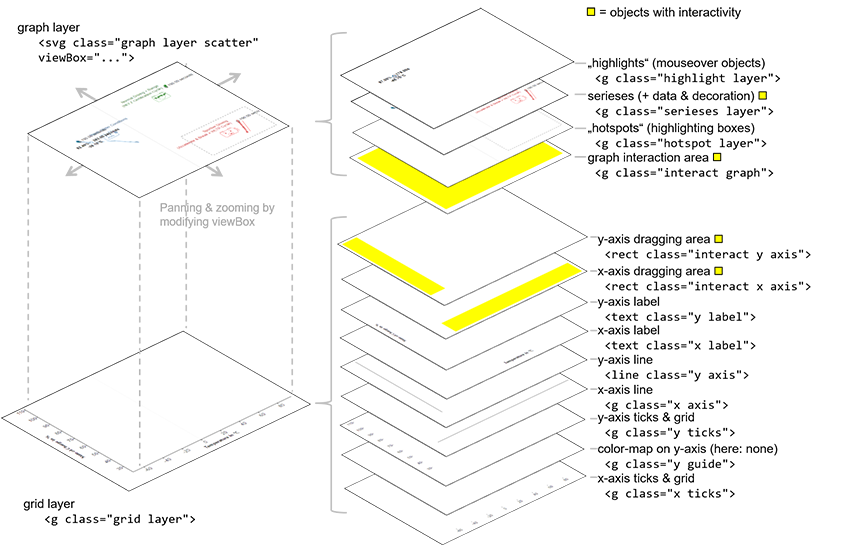

All components of the applications that draw a chart make use of the ``AppChart`` class which is the only one that actually issues [d3.js][d3js] code. The ``AppChart`` gets one container object and places an inline SVG into it which it then further subdivides into various layers and sub-layers. Each layer is stored in an internal variable of the ``AppChart`` object and thusly easily accessible when drawing/updating data.

When designing this layer structure, the following problems had to be solved:

* Zooming and panning worked best when encapsulating everything "movable" in one big sub-SVG, the ``graph layer``. This SVG can then get a ``viewBox`` attached allows to clip a window of the graph that is actually to be shown.
* In order to add interactivity, certain transparent rectangles, in the image shown in yellow, had to be added (for example to be able to catch drag-events on anotherwise empty graph canvas).
* Attaching classes to the SVG elements allowed for easy CSS-manipulation via the CSS file ``css/_AppChart.sass``.
* Sometimes those classes are added and removed dynamically, e.g., if certain elements are highlighted by mouseover (e.g. class ``highlighted``).

The following picture shows the resulting structure of those layers:

[d3js]: https://d3js.org/
